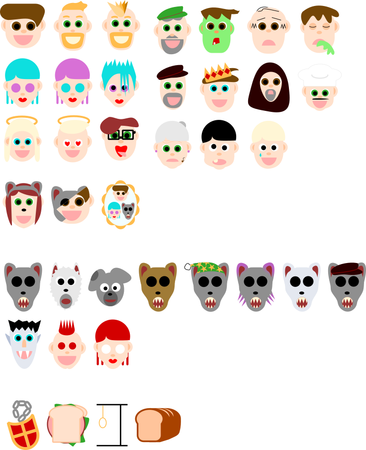

# Werewolf Online Project 🐺

This project contains the code for playing the game Werewolf online. The code is divided into 2 chunks. One for a discord bot and the other for a web app. Neither is completed, but I'm currently focusing my development time on the discord bot.

## Character Artwork
*I'm not an artist*


## Design Goals
### Few number of commands

I want the number of commands that need to be run by the end user to be very low. I think most people find commands a little intimidating. If I can reduce the number of commands required to be used by each user to just one. The exception is the <abbr title="Game Master">GM</abbr> can run more commands, but I'd still like to keep it low.

### Minimal Number of Channel Switching

When running a game as a GM I noticed I had to do a lot of channel switching. The same goes for when your playing a game. You're watching the video then when it's time to do the lynch action our current workflow requires players to click on an emoji in a seperate channel. Furthermore the werewolves must send messages in a secret chat, and finally if your a seer you also have to send direct messages. That's a lot of stuff.


## Installation

This project requires at least node v14

```
npm install
```

Create a discord bot and get the bot token.
Then create a .env file in the root of the project:
```
DISCORD_BOT_TOKEN=<YOUR_TOKEN>
```

Note is the bot token. Not the app token.


### Running tests

To run the tests you must first setup build the project with `tsc`. Then you can run them:

```
tsc
npm test
```

Note this project makes use of EMCAscript modules. This is feature has experimental support in node so many tools will have to have special flags enabled to turn it on.


## TODO

After attempting to GM a game I noticed the following areas for improvement.

- If a Characters Image is broken you cannot use that role
- Pointing in a public channel isn't private
    - Potential Solution: Create seperate private text channels for each role
- Voting / Nomination Workflow is too slow
- Specify Amulate in start command
- Update list of players from voice channel properly (Sometimes is pulls an outdated list)
- Updates channel for all users
- Spectator Lobby (See all actions mirrored when dead)
- Add a way to include players not in the voice channel
- Add a way to exclude players from the voice channel
- Way for user to join game manually


